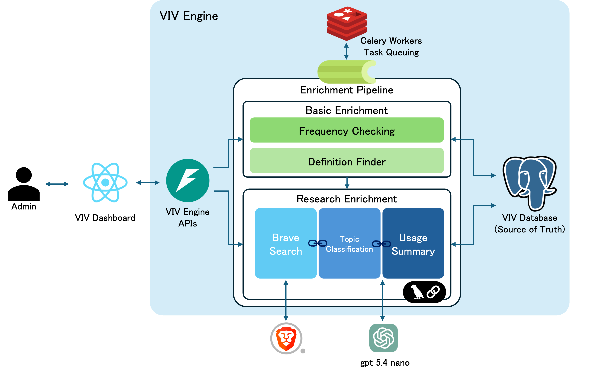
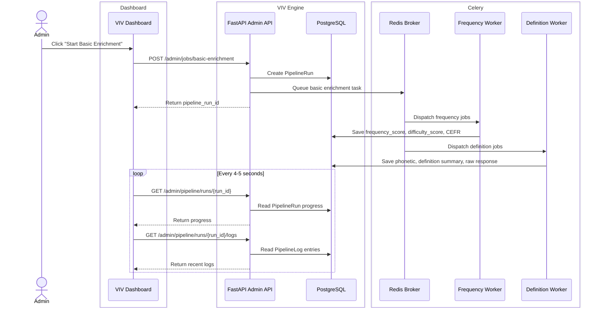
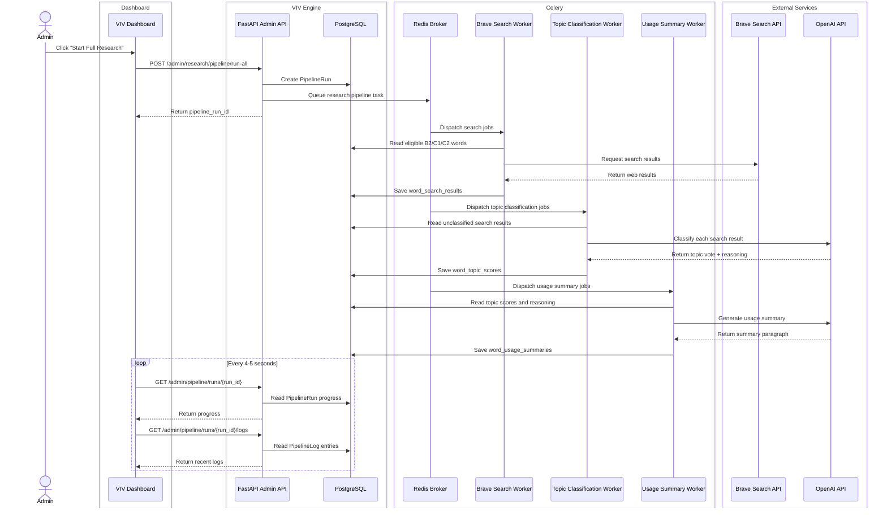

## Project Overview

**VIV (Very Important Vocabulary)** is an AI-powered vocabulary intelligence platform designed to help English learners decide which words are actually worth studying.

Traditional vocabulary tools usually answer simple questions like “What does this word mean?” or “Is this word difficult?” VIV goes further by analyzing each word from multiple angles: how common it is, how difficult it is, and where it appears in real-world usage.

VIV combines frequency analysis, dictionary-based enrichment, web search, AI topic classification, and usage summarization to build a practical learning profile for each word. Instead of treating vocabulary as a flat word list, VIV tries to answer a more useful question:

> “Is this word important enough to learn, and in what real-life contexts is it used?”

The system first calculates frequency and difficulty scores for each word using linguistic frequency data. It then enriches words with definitions and phonetic information. For more advanced words, VIV searches real web results, classifies each result into usage topics, aggregates those topic signals, and generates a short explanation of how the word is commonly used online.

This makes VIV useful for learners who want to focus their study time on vocabulary that is not only difficult, but also meaningful, practical, and visible in real-world English.

# VIV Engine

VIV Engine is the backend data platform that powers the VIV vocabulary learning ecosystem.

It is responsible for collecting, enriching, and maintaining vocabulary data used by VIV applications. Through an asynchronous enrichment pipeline, the engine analyzes each word and stores its linguistic and real-world usage information, including:

- Frequency and difficulty scores
- CEFR level estimation
- Dictionary definitions and phonetics
- Real-world search results
- AI-based topic classification
- Usage summaries

Rather than serving end users directly, VIV Engine acts as the central source of truth for vocabulary data. Every enrichment task writes its results into PostgreSQL, allowing the pipeline to resume safely after interruptions and enabling other applications to consume a consistent vocabulary dataset.

The VIV ecosystem currently consists of two projects:

- **VIV Engine** — Backend enrichment pipeline, APIs, and vocabulary database *(this repository)*
- **VIV Dashboard** — React-based administration dashboard for monitoring and controlling enrichment pipelines *(https://github.com/Jongeum-k/viv-dashboard)*

<h3 align="center">System Architecture</h3>

<p align="center">
  
</p>

<p align="center">
<i>Figure 1. Overall architecture of the VIV Engine.</i>
</p>

## How VIV Analyzes Words

VIV evaluates each word through a staged enrichment pipeline.

### 1. Frequency and Difficulty

VIV uses word frequency data to estimate how common a word is in English. Common words receive higher practical value, while rare words may be treated as more specialized.

The system also calculates a difficulty score and assigns a CEFR-like level such as A1, A2, B1, B2, C1, or C2. This helps separate beginner-level vocabulary from advanced academic, technical, or domain-specific vocabulary.

### 2. Dictionary Enrichment

VIV retrieves dictionary information for each word, including pronunciation, definitions, and raw dictionary response data. This gives the platform a basic linguistic profile before deeper real-world analysis begins.

### 3. Real-World Search

For more advanced words, VIV performs web search using external search APIs. These results help reveal where the word actually appears: news, business, medicine, technology, gaming, religion, education, legal writing, and other real contexts.

### 4. AI Topic Classification

Each search result is classified independently by an AI worker. Instead of asking one AI model to make a single final judgment, VIV treats the AI like multiple independent voters.

Each result receives a topic classification such as:

- daily life
- business/work
- technology
- medical/health
- legal/government
- education
- gaming/entertainment
- religion/philosophy
- unknown/other

The final topic profile is created by aggregating many individual classifications.

### 5. Usage Summary

After topic classification, VIV generates a short usage summary explaining how the word appears in real-world contexts. This helps learners understand not just the meaning of a word, but where they are likely to encounter it.

## Enrichment Workflow

### Basic Enrichment Workflow



### Research Enrichment Workflow



## Technology Stack

| Category               | Technology               |
|------------------------|--------------------------|
| Backend                | FastAPI                  |
| Language               | Python 3.9               |
| Package Manager        | uv                       |
| Containerization       | Docker                   |
| Database               | PostgreSQL               |
| ORM                    | SQLAlchemy 2.x           |
| Word frequency library | wordfreq                 |
| Task Queue             | Celery                   |
| Broker                 | Redis                    |
| AI                     | OpenAI GPT-5.4 Nano      |
| Search                 | Brave Search API         |
| Dictionary             | dictionaryapi.dev        |
| Frontend               | React + Vite (Dashboard) |

## Project Structure

```text
VivEngineProject/
├── app/
│   ├── apis/                 # FastAPI admin endpoints
│   ├── models/               # SQLAlchemy ORM models
│   ├── tasks/                # Celery worker tasks
│   ├── celery_app.py         
│   ├── config.py             
│   ├── db.py                 
│   └── main.py               
│
├── docs/
│   └── images/               # README diagrams and screenshots
│
├── scripts/                  # Development startup scripts
│
├── .env.example
├── docker-compose.yml.example
├── Makefile
├── pyproject.toml
├── README.md
├── script.sql                # DB tables setup script
└── uv.lock
```

## Getting Started
Clone the repository:

```bash
git clone https://github.com/Jongeum-k/viv-engine.git
cd VivEngineProject
Install dependencies:
````

```bash
uv sync
```

Make the development scripts executable:
```bash
chmod +x scripts/*.sh
```
Start the development environment:
```bash
make dev
```

    